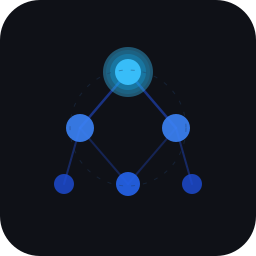

<p align="center">
  
</p>

<h1 align="center">Graphify Workspace Cockpit</h1>

<p align="center">
  <b>See your whole codebase the way you actually think about it — then decide what to do next, with the evidence right in front of you.</b>
</p>

<p align="center">
  <a href="https://github.com/safishamsi/graphify"></a>
  
  
  
  
</p>

A local-first decision cockpit for developers and builders who use [Graphify](https://github.com/safishamsi/graphify) to map their workspace. Point it at one folder, get every repo underneath it as a single, queryable map — then ask questions across all of them, record the calls you make, and let nothing run until you approve it.

> Show me what I have, explain what it means, recommend what to do next — and wait for permission before acting.

---

## The idea (in 30 seconds)

AI coding agents are powerful — but they pay tokens to *re-read your code* every time they answer a question. And across a dozen repos, you lose the big picture entirely.

**Graphify** solves the first half: it turns a codebase into a semantic graph you can *query* instead of *read*. Ask "where does auth live?" and you get back the handful of nodes that matter — not forty files.

**This cockpit** solves the second half. It takes that graph and turns it into a place to actually make decisions:

- 🗺️ **One map across every repo.** Point Graphify at a parent folder and see all your projects — and the connections *between* them — at once.
- 💬 **Ask in plain language.** Questions answered straight from the graph, with the evidence nodes you can click into.
- 🧭 **Decisions that stick.** Mark any area *invest / ship / monitor / archive* — future you, and any AI agent you hand this to, sees the call you already made.
- 🔒 **Nothing runs without you.** Recommendations are proposals; every action waits behind a dry-run preview and an explicit approval.

Local-first and read-only by default — your graph, your decisions, and your secrets stay on your machine.

---

## Built on Graphify

This project is powered by **[Graphify](https://github.com/safishamsi/graphify)** — an open-source tool by [safishamsi](https://github.com/safishamsi) that extracts semantic knowledge graphs from codebases and workspaces.

Graphify does the heavy lifting:
- Indexes your workspace into a traversable `graph.json`
- Exposes `graphify query`, `graphify path`, and `graphify explain` commands
- Finds relationships, communities, and patterns across any codebase or project folder

The cockpit is a UI layer on top of that graph. All credit for the core extraction and query engine belongs to the Graphify project.

---

## What This Cockpit Does

| Surface | What it does |
|---------|--------------|
| **Command** | First-screen readiness and attention view for runtime state, pending recommendations, accepted-but-not-queued work, dry-run-ready actions, untriaged overlaps, and graph freshness |
| **Ask** | Natural language questions answered from your graph (`graphify query/path/explain`) with optional local Ollama synthesis |
| **Map** | Interactive project-level relationship map — inspect nodes, trace paths, review overlap, and click semantic links for decision options |
| **Decisions** | Durable ledger of human decisions about workspace areas: invest, client-ready, monitor, archive, or paused |
| **Recommendations** | Model-backed cards with evidence, confidence, risk, action plans, read-only decision packets, and accept/reject/defer controls |
| **Work Queue** | Approval-gated action queue with dry-run previews, rollback notes, and execution reports |
| **Settings** | Graph upload, Ollama status, source + cluster toggles, AI assistant configuration, and graph rebuild |
| **AI Assistant** | Floating draggable/resizable chat panel — available in every tab. Streams responses from Ollama using your active cluster context. Collapse to a button when not needed. |

---

## Safety Model

- Read-only by default. No destructive actions without explicit human approval.
- Recommendations are proposals — they do not trigger actions.
- Decision packets combine evidence, judgement, recommendations, and approval state for review only; actions still flow through the Work Queue dry-run gate.
- No autonomous commits, pushes, deletes, or unapproved external side effects.
- Supabase and cloud connectors are opt-in and disabled unless configured.
- Automatic graph escalation is opt-in. When configured, the local Ollama router can choose an elevated Graphify extraction backend for broad or hard workspace selections.
- User-supplied graphs stay local. Secrets and environment files are never indexed, printed, or committed.

> **Security note:** Leave `API_KEY` unset only for localhost use. Set `API_KEY` before exposing the backend to any non-local network, and prefer HTTPS for hosted deployments.

---

## Prerequisites

- Python 3.10+ (backend)
- Node.js 18+ and npm (frontend)
- [Graphify](https://github.com/safishamsi/graphify): `pip install graphifyy` (required for Ask and workspace graph rebuild)
- [Ollama](https://ollama.com) (optional — cockpit works without it, recommendations fall back to graph-only)

---

## Quick Start (one command)

The fastest way to run the cockpit. The launcher sets up the backend and frontend
on first run, starts both, and opens your browser at `http://localhost:5173`.
Assumes Python 3.10+ and Node 18+ are installed (see Prerequisites); the Docker
path below needs neither.

**Linux / macOS**

```bash
git clone <repo-url>
cd graphify-workspace-cockpit
./launcher/launch-cockpit.sh
```

For a click-to-launch icon in your application menu (Linux), run this once:

```bash
bash launcher/install-desktop-entry.sh
```

Then start the cockpit any time from your app menu — no terminal needed.

**Windows**

```bat
git clone <repo-url>
cd graphify-workspace-cockpit
launcher\launch-cockpit.bat
```

The Windows launcher creates `backend\.venv`, installs backend and frontend
dependencies when needed, loads optional `backend\.env` and `frontend\.env`
files, starts both services, and opens the browser.

After pulling updates or changing cockpit code, use:

```bat
launcher\restart-cockpit.bat
```

That refreshes the backend and frontend dev servers on ports 8000 and 5173 so
the browser sees the latest local code.

**Any OS (Docker)**

```bash
docker-compose up --build
```

Docker is the verified cross-platform option — see
[docs/deployment-guide.md](docs/deployment-guide.md) for Windows Docker Desktop
and Linux server instructions.

> **Coming later:** a true double-click desktop app with native installers for
> Windows and Linux — no terminal, no prerequisites — is planned once real-world
> usability on other machines is confirmed. For now, the launchers above and the
> Docker path are the supported ways to run it.

Prefer to set up each piece by hand? See **Setup: Local Dev Mode** below.

---

## Setup: Local Dev Mode

This is the manual path — set up each piece yourself. Use it if you want full
control or the one-command launcher above doesn't fit your environment. No Docker
required.

**1. Clone and install**

```bash
git clone <repo-url>
cd graphify-workspace-cockpit
```

**2. Set up the backend**

```bash
cd backend
python3 -m venv .venv
source .venv/bin/activate          # Windows: .venv\Scripts\activate
pip install -r requirements.txt
```

**3. Point it at your graph** (optional — first launch starts with no graph)

```bash
cp .env.example .env               # still in the backend/ directory
# Leave GRAPH_PATH blank for a fresh instance, or set it to an existing graph.json:
# GRAPH_PATH=/path/to/your/workspace/graph.json
```

To generate a graph from your own workspace:
```bash
pip install graphifyy
graphify update /path/to/your/workspace
```

The backend reports Graphify runtime status in `/health` and Settings. If the
CLI is missing, the cockpit still opens, but Ask and graph rebuild return
`GRAPHIFY_MISSING` until Graphify is installed on `PATH`.

**4. Set up the frontend**

```bash
cd ../frontend
npm install
```

**5. Launch both**

Windows:

```powershell
cd ..
powershell -NoProfile -ExecutionPolicy Bypass -File launcher\launch-cockpit.ps1
```

Linux / macOS:

```bash
cd ..
bash scripts/start.sh
```

The app opens at `http://localhost:5173` or `http://127.0.0.1:5173`.
Backend runs at `http://localhost:8000` or `http://127.0.0.1:8000`.

---

## Setup: Docker (Hosted Mode)

Use this when you want to run the cockpit on a server or access it from multiple devices.

**1. Clone**

```bash
git clone <repo-url>
cd graphify-workspace-cockpit
```

**2. Configure**

```bash
cp .env.example .env
# Optionally edit .env — leave GRAPH_PATH blank for a fresh instance
```

**3. Start**

```bash
docker-compose up --build
```

- Frontend: `http://localhost:5173`
- Backend API: `http://localhost:8000`

State (decisions, recommendations, actions) is persisted in `workspace/state/` on the host via a Docker volume mount.

The backend image installs `graphifyy` from `backend/requirements.txt`, so Ask
and graph rebuild are available in Docker as long as any configured scan paths
exist inside the container.

**Key env vars for hosted mode:**

| Variable | Default | Notes |
|----------|---------|-------|
| `GRAPH_PATH` | unset | Optional path to your graph.json inside the container. Leave blank until you generate or upload a workspace graph. |
| `STATE_DIR` | `workspace/state` | Persistent state directory |
| `CORS_ORIGINS` | `http://localhost:5173` | Comma-separated list of allowed frontend origins; include the exact `localhost` or `127.0.0.1` URL you use |
| `OLLAMA_URL` | `http://host.docker.internal:11434` | Ollama server URL — `host.docker.internal` reaches the host machine |
| `RECOMMEND_MODEL_DEFAULT` | `local-balanced:latest` | Local Ollama model for chat, recommendations, and overlap triage |
| `SEMANTIC_MODEL_DEFAULT` | `nomic-embed-text:latest` | Local Ollama embedding model for semantic overlap analysis |
| `OLLAMA_KEEP_ALIVE` | `30m` | How long Ollama keeps the local model resident between requests (sent per-request). Keeps the model warm so CPU-only machines avoid a cold reload each interaction. Duration (`30m`), seconds, `0` to unload immediately, or `-1` to stay loaded. |
| `GRAPH_ESCALATION_ENABLED` | `false` | Enables automatic local-vs-elevated routing during graph generation |
| `GRAPH_ESCALATION_BACKEND` | unset | Graphify `extract` backend used when the local router elevates (`gemini`, `claude`, `openai`, `deepseek`, `ollama`, etc.) |
| `GRAPH_ESCALATION_MODEL` | unset | Optional model override for the elevated backend |
| `GRAPH_ESCALATION_FILE_THRESHOLD` | `1500` | Heuristic fallback threshold when the local routing model is unavailable |
| `VITE_API_URL` | `http://localhost:8000` | Backend URL the browser sends requests to (build-time). Use `/api` for Caddy-hosted same-origin deployments; use an absolute backend URL when the frontend and API are served separately. |
| `API_KEY` | unset | Required before exposing the backend beyond trusted localhost use |

To use your own graph with Docker, either:
- Set `GRAPH_PATH` to a path inside the container and mount the file
- Or use the graph upload API

> **Security note:** When you run this on a non-local host, set `API_KEY` and use HTTPS before exposing the backend to a network. In the browser, open Settings → API to save, test, or clear the key locally; the UI sends it as `X-API-Key` on backend requests.

---

## Sample Graph

A synthetic sample graph (`workspace/demo/graph.json`) ships with the repo for tests and manual demo work. It is not activated by default; a fresh instance starts with no workspace graph until you generate one from Scope or upload one in Settings. No private workspace data is included.

For the current demo-readiness gate, run:

```bash
source "$HOME/.nvm/nvm.sh" && node scripts/demo-path-smoke.mjs
```

Then follow `docs/demo-path-checklist.md` for the manual click path.

---

## Configuration Reference

**Backend** (see `.env.example` for Docker/project defaults, or
`backend/.env.example` for native local runs):

```
GRAPH_PATH      Optional path to graph.json (default: unset; no active graph yet)
STATE_DIR       Persistent state directory (default: workspace/state)
CORS_ORIGINS    Comma-separated allowed origins (default: http://localhost:5173)
OLLAMA_URL      Ollama base URL (default: http://localhost:11434)
OLLAMA_KEEP_ALIVE  Keep the local model warm between requests (default: 30m)
GRAPH_ESCALATION_ENABLED  Enable automatic graph escalation (default: false)
GRAPH_ESCALATION_BACKEND  Elevated Graphify extract backend when enabled
API_KEY         Optional API key for non-local deployments
```

**Frontend** (see `frontend/.env.example`):

```
VITE_API_URL    Backend API URL (default: http://localhost:8000)
```

For the optional Caddy HTTPS profile, build the frontend with
`VITE_API_URL=/api`. Caddy routes `/api/*` to the backend after stripping the
`/api` prefix, while `/` continues to serve the frontend.

When `API_KEY` is set, the frontend can store the key in browser localStorage
from Settings → API. Leave `API_KEY` unset only for fully trusted local
development.

---

## Stack

| Layer | Technology |
|-------|------------|
| Backend | Python FastAPI |
| Frontend | React + Vite (TypeScript) |
| Graph view | Cytoscape.js |
| Local model | Ollama HTTP API (optional) |
| Graph input | Graphify `graph.json` |
| Container | Docker + nginx |

---

## Documentation

- [docs/architecture.md](docs/architecture.md) — component map, data flow, state layout
- [docs/relationship-map-plan.md](docs/relationship-map-plan.md) — active relationship-map plan
- [docs/workspace-scope-and-signal-plan.md](docs/workspace-scope-and-signal-plan.md) — completed workspace scope and signal history
- [docs/stabilization-plan.md](docs/stabilization-plan.md) — completed hosted-beta stabilization evidence
- [docs/current-build-pathway.md](docs/current-build-pathway.md) — archived 0-to-1 build history and old validation evidence
- [docs/manual.md](docs/manual.md) — operator and developer manual
- [docs/runbook.md](docs/runbook.md) — operational startup, failure, and recovery notes
- [docs/demo-path-checklist.md](docs/demo-path-checklist.md) — demo-readiness smoke and manual walkthrough
- [docs/roadmap.md](docs/roadmap.md) — what's next
- [docs/CHANGELOG.md](docs/CHANGELOG.md) — chunk-by-chunk change history
- [docs/agent-inventory.md](docs/agent-inventory.md) — agent definitions and autonomy levels
- [docs/tool-permission-matrix.md](docs/tool-permission-matrix.md) — what the cockpit can and cannot do
- [docs/risks/risk-register.md](docs/risks/risk-register.md) — known risks and controls
- [docs/vision.md](docs/vision.md) — strategic direction and multi-device architecture

---

## Help it reach the next builder

If the cockpit saves you time or tokens, a ⭐ on the repo genuinely helps other Graphify users find it. Issues, ideas, and pull requests are welcome — this is built in the open, in the same spirit Graphify was shared in the first place.

---

## Credits

Core graph engine: **[Graphify](https://github.com/safishamsi/graphify)** by [safishamsi](https://github.com/safishamsi) — `pip install graphifyy`

Cockpit UI, recommendation layer, decision ledger, and work queue: Adam Goodwin / Guided AI Labs
